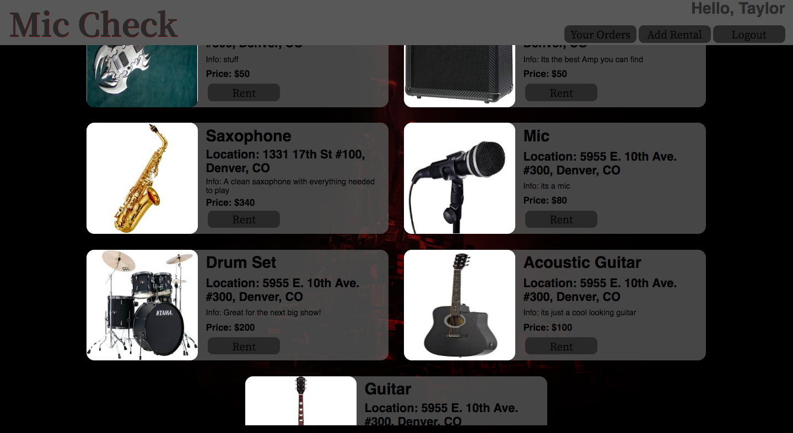
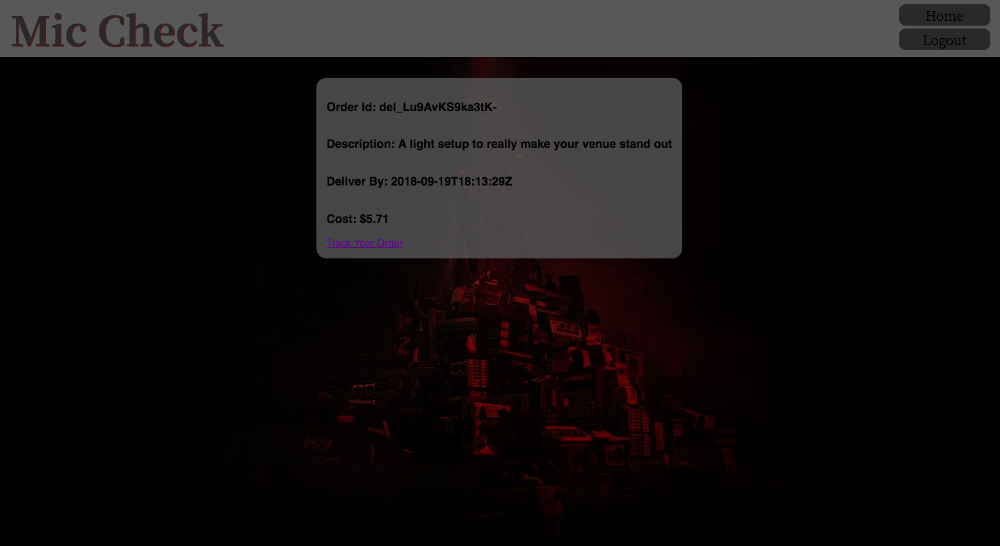
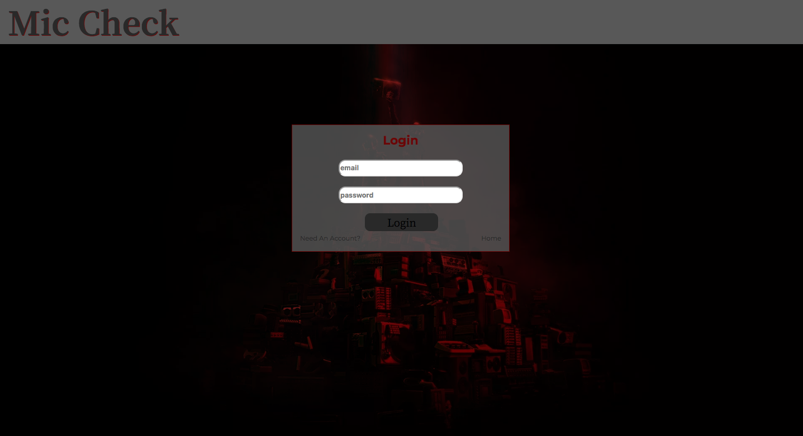

## Mic-Check

Mic-Check is a project designed to help musicians coordinate rental equipment delivery to a destination, as well retailers can post items they would like to rent. The project utilized asynchronous fetch calls to [The PostMates API](https://postmates.com/ "The PostMates API") to coordinate the shipping of items for rent. The UI is designed to have all rental items displayed on the main page. A user will have to sign up or login once they have an account to be able to rent equipment or to post their items for rent. Tech used in this project include: React, Redux, Router, Thunks(middleware), tested with Jest and Enzyme. Local storage was chosen to simulate a backend functionality till a node.js one can be built, a backend was not in the scope of the project. The project was built over the course of 10 days and was an individual project.

### Installation Instructions

* git clone https://github.com/JoOCon/mic-check
* npm install
* npm start

### Application Navigation

From the home screen a user may select "Sign up" to create a new account or "Log in" if they are an existing user. Once information is entered the user will find themselves located at their user page. Once logged in the user can select add rental and it will navigate you to a rental form. On the home page when items for rent are populated a user can click to rent a item this will produce a quote and if desired the user can confirm the order. Completed orders as well as order delivery tracking can be checked in by clicking the your orders button.

### Screenshots

  

 

  
